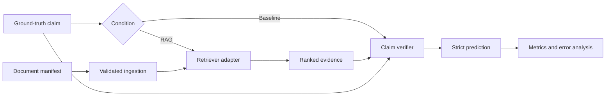

# RAG Claim Verification

## Project overview

RAG Claim Verification is a modular research application for classifying atomic factual claims against a controlled document collection. The current domain is Michael Schumacher's Formula One career from 1991 through 2012. The implementation supports reproducible comparisons between a language-model baseline, retrieval over a clean corpus, and retrieval over the same corpus with added noise.

This project does **not** claim to detect fake news in general. It tests evidence-based verification inside a deliberately bounded knowledge domain.

## Research scope

The guiding question is:

> How reliably can a RAG system verify factual claims within a closed knowledge domain, and how does performance change when irrelevant documents are added to the knowledge base?

Every claim receives one of three labels:

- `SUPPORTED`: available evidence confirms every material part of the claim;
- `REFUTED`: available evidence contradicts at least one material part;
- `NOT_ENOUGH_EVIDENCE`: evidence is absent, ambiguous, unrelated, or insufficient.

The benchmark supports three controlled conditions:

1. an LLM-only baseline without retrieval;
2. RAG over a clean domain corpus;
3. RAG over that complete clean corpus plus additional irrelevant or partially relevant documents.

`enforce_comparability: true` rejects accidental model-setting differences and inconsistent RAG `top_k` values across conditions. Conditions share prompt files and generation parameters. The prompt carries an explicit mode marker because the baseline intentionally has no external evidence: RAG mode is restricted to retrieved evidence, while baseline mode uses parametric model knowledge and cannot cite documents.

## Current MVP

The implemented MVP provides:

- strict Pydantic models for documents, claims, evidence, predictions, and run metadata;
- JSONL manifest and ground-truth loading with line-specific validation errors;
- missing-file, empty-document, duplicate-ID, and clean-corpus-superset checks;
- a pinned LightRAG SDK adapter and reproducible ingestion metadata;
- a deterministic keyword retriever for tests and offline demonstrations;
- an OpenAI-compatible chat-completions client for hosted APIs and local servers;
- strict structured verdict parsing with at most one JSON repair request and no label fallback;
- CLI workflows for validation, ingestion, single-claim verification, benchmarking, and re-evaluation;
- classification, retrieval, reporting, and failure-analysis artifacts;
- tests that do not call paid APIs by default.

## Explicit non-goals

The MVP does not implement a web UI, automatic web search, article collection, whole-article fake-news detection, mandatory claim extraction, late chunking, advanced reranking, multiple RAG frameworks, multi-model sweeps, end-user on-the-fly ingestion, or invented confidence scores. It also does not establish that the included synthetic examples are representative of the research domain.

## Architecture



Retrieval and verification are intentionally separate. This makes it possible to distinguish missing evidence from model interpretation errors. LightRAG-specific calls are confined to `retrieval/lightrag_adapter.py`; the verifier knows only the small retriever and LLM protocols.

## Repository structure

```text
.
├── configs/                  # Corpus and benchmark YAML configurations
├── data/
│   ├── corpora/              # Small tracked synthetic text fixtures only
│   ├── manifests/            # Document metadata as JSONL
│   └── ground_truth/         # Example claims as JSONL
├── prompts/                  # Versioned system and user prompts
├── src/rag_claim_verification/
│   ├── models/               # Strict domain and run models
│   ├── ingestion/            # Manifest parsing, loading, ingestion orchestration
│   ├── retrieval/            # Retriever protocol, keyword retriever, LightRAG adapter
│   ├── llm/                  # LLM protocol, HTTP client, structured parsing
│   ├── verification/         # Prompt rendering, RAG and baseline verification
│   ├── evaluation/           # Benchmark runner, metrics, reporting, re-evaluation
│   └── utils/                # Atomic files and hashing
├── tests/                    # Unit and offline integration tests
└── runs/                     # Generated runs; ignored except for .gitkeep
```

## Installation

Python 3.11 or newer is required. Python 3.12 is used for the local verification described below.

```bash
python -m venv .venv
```

Activate the environment on Linux or macOS:

```bash
source .venv/bin/activate
```

Activate it on Windows PowerShell:

```powershell
.venv\Scripts\Activate.ps1
```

Install the offline-testable core plus development tools:

```bash
python -m pip install -e ".[dev]"
```

Install the real LightRAG integration when ingestion or LightRAG retrieval is needed:

```bash
python -m pip install -e ".[dev,lightrag]"
```

The optional dependency is pinned to `lightrag-hku==1.5.4`. The adapter follows the public SDK in the [LightRAG 1.5.4 source](https://github.com/HKUDS/LightRAG/tree/v1.5.4) and its [Core programming guide](https://github.com/HKUDS/LightRAG/blob/v1.5.4/docs/ProgramingWithCore.md), specifically explicit storage initialization/finalization, `ainsert`, and structured `aquery_data` retrieval.

## Environment configuration

Copy `.env.example` to `.env` and fill in keys locally. `.env` is ignored by Git.

```bash
cp .env.example .env
```

The main variables are:

| Variable | Purpose |
|---|---|
| `RAGCV_LLM_BASE_URL` | OpenAI-compatible endpoint used for verdict generation |
| `RAGCV_LLM_API_KEY` | Verification endpoint key |
| `RAGCV_LLM_MODEL` | Verification model name |
| `RAGCV_LIGHTRAG_LLM_*` | LightRAG extraction and query model settings |
| `RAGCV_EMBEDDING_*` | LightRAG embedding endpoint, model, and dimension |

Configuration stores only the API-key environment-variable name, never the key. Model endpoints are stripped of credentials, query parameters, and fragments before run metadata is written. For a local endpoint such as LM Studio, set the base URL (commonly `http://localhost:1234/v1`) and set `api_key_required: false` in the relevant YAML object if the server does not require a key.

YAML supports `${NAME}` and `${NAME:-default}` interpolation. Paths in YAML are resolved relative to that YAML file. Paths in a document manifest are resolved relative to the manifest itself.

## Preparing a document corpus

The tracked files under `data/corpora/` are short, hand-written synthetic examples. They are not research data or research results.

For a real corpus, place permissible UTF-8 text files outside Git or under the ignored `data/corpora/local/` directory. Add one metadata object per line to a JSONL manifest:

```json
{"document_id":"doc_001","title":"Example title","source":"Example source","publication_date":"2024-01-01","event_date":"1994-11-13","topic":"1994 championship","language":"en","file_path":"../corpora/local/doc_001.txt","corpus_tags":["clean","schumacher"]}
```

Required fields are `document_id`, `title`, `source`, and `file_path`. Dates, topic, language, and tags are optional. `publication_date` and `event_date` are intentionally distinct.

Validate the manifest and every referenced file before ingestion:

```bash
rag-claim-verification validate-corpus \
  --manifest data/manifests/clean_documents.jsonl
```

Validate a noisy manifest as a content-preserving superset:

```bash
rag-claim-verification validate-corpus \
  --manifest data/manifests/noisy_documents.jsonl \
  --clean-manifest data/manifests/clean_documents.jsonl
```

Validation is all-or-nothing. Invalid records are never silently skipped.

## Preparing ground-truth claims

Claims use JSONL:

```json
{"claim_id":"claim_001","claim":"Michael Schumacher won the 1994 Formula One World Championship.","gold_label":"SUPPORTED","gold_document_ids":["doc_001"],"notes":"Direct factual claim."}
```

Benchmark records require a gold label. `gold_document_ids` is optional, but retrieval metrics can be computed only for claims that provide it. Claims should be atomic enough that a single three-way verdict is meaningful. The example file at `data/ground_truth/claims.example.jsonl` is synthetic and unsuitable for scientific evaluation.

## Validating configuration

```bash
rag-claim-verification validate-config --config configs/benchmark.yaml
```

This parses environment interpolation, validates cross-field constraints and referenced local inputs, and prints the resolved non-secret configuration. It does not contact providers or require an already-built index.

CLI exit code `0` means the requested workflow completed without failed predictions, `1` means a verify/benchmark workflow completed but recorded at least one failed prediction, and `2` indicates invalid input, missing prerequisites, or another operational error.

## Ingesting a corpus

Ingest the clean and noisy indexes separately:

```bash
rag-claim-verification ingest --config configs/clean_corpus.yaml
rag-claim-verification ingest --config configs/noisy_corpus.yaml
```

Ingestion performs complete manifest/file validation before contacting LightRAG. It passes stable document IDs and declared file paths to LightRAG, then writes `ragcv_ingestion_metadata.json` into the configured working directory. That file records the corpus ID, content-sensitive corpus hash, index-configuration hash, document IDs, content hashes, LightRAG version, timestamp, and LightRAG tracking ID. A working directory already associated with a different corpus, manifest content, index-relevant configuration, or LightRAG version is rejected instead of mixed or overwritten. A non-empty directory without RAGCV ingestion metadata is rejected as well.

The clean and noisy configurations use distinct index directories under `indices/`, which is ignored by Git.

## Verifying a single claim

After ingesting the selected corpus:

```bash
rag-claim-verification verify \
  --config configs/clean_corpus.yaml \
  --claim "Michael Schumacher won the 1994 championship."
```

The command prints one structured `Prediction`, including retrieved evidence, citations, raw model output, parsing status, and timing. It does not write a benchmark run.

## Running a benchmark

The example benchmark declares baseline, clean RAG, and noisy RAG conditions:

```bash
rag-claim-verification benchmark \
  --config configs/benchmark.yaml \
  --claims data/ground_truth/claims.example.jsonl
```

`--claims` is optional and overrides `claims_file`. Claims are processed in file order and conditions are run sequentially to avoid uncontrolled concurrency effects. Model or retrieval failures are recorded as failed predictions where possible, rather than converted into invented labels.

Run the baseline alone with:

```bash
rag-claim-verification benchmark --config configs/baseline.yaml
```

## Run outputs and interpretation

Each benchmark creates a unique, never-overwritten directory:

```text
runs/<run-id>/
├── metadata.json
├── resolved_config.yaml
├── predictions.jsonl
├── metrics.json
├── metrics.csv
├── confusion_matrix.csv
├── failures.jsonl
└── summary.md
```

- `metadata.json` records time, Git commit when available, Python/platform/package versions, model and endpoint, temperature, retriever, top-k, input hashes, prompt version/hash, and success/failure counts.
- `resolved_config.yaml` snapshots the benchmark and corpus settings without API-key values.
- `predictions.jsonl` preserves verdicts, ground truth, retrieved evidence, raw and repair outputs, citations, errors, and latencies.
- `metrics.json` is the authoritative structured metric output.
- the CSV files simplify analysis in spreadsheets and statistical tools.
- `failures.jsonl` assigns only observable diagnostic categories, such as missing gold evidence or an incorrect verdict despite retrieved gold evidence.
- `summary.md` describes measured values without extrapolating beyond them.

Regenerate derived artifacts without calling a model or retriever:

```bash
rag-claim-verification evaluate --run-dir runs/<run-id>
```

## Evaluation metrics

Classification output includes:

- accuracy;
- precision, recall, F1, and support per class;
- unweighted Macro-F1 across all three labels;
- a confusion matrix with an explicit `NO_PREDICTION` column;
- parse-error and pipeline-error counts and rates.

Missing/failed predictions count as incorrect for accuracy and as false negatives for their gold class. They never receive a fabricated fallback label.

For retrieval, the application computes Evidence Recall@1, @3, and @5 as the mean fraction of each claim's gold document IDs found in the first `k` ranks, plus Mean Reciprocal Rank of the first relevant document. A condition receives retrieval metrics only when gold IDs exist and every eligible retrieval can be mapped to concrete document IDs. Otherwise `metrics.json` records an explicit unavailability reason.

No weighted aggregate is used as the sole headline metric. The MVP does not calculate confidence intervals or statistical significance tests.

## Reproducibility

The application protects reproducibility through:

- a `src` package and declared Python requirement;
- a fixed LightRAG version;
- versioned prompt files and prompt hashes;
- content-sensitive corpus hashes and claim/config file hashes;
- low default verification temperature (`0.0`);
- bounded retries and exactly one structured-output repair attempt;
- unique run IDs and refusal to overwrite run directories;
- resolved non-secret configuration snapshots;
- recorded runtime and package versions;
- deterministic offline components and tests.

Temperature zero reduces sampling variability but does not guarantee deterministic behavior across hosted model revisions, hardware, or provider implementations. For serious experiments, pin provider-side model revisions when the provider supports them and archive the exact raw inputs and predictions.

Run local quality checks with:

```bash
python -m pytest
python -m ruff check .
python -m ruff format --check .
python -m mypy src
```

Tests marked `external` are skipped by default. After installing the LightRAG extra, set `RAGCV_RUN_EXTERNAL_TESTS=1` to enable the pinned-version check. Standard tests never call an external or paid service.

## Data and copyright considerations

Do not commit copyrighted article full text merely because it is publicly reachable. Keep local documents under an ignored path or outside the repository and maintain independent provenance, licensing, acquisition-date, and transformation records. A manifest records technical metadata; it does not establish redistribution rights.

The tracked synthetic fixtures are deliberately short and clearly marked. They demonstrate mechanics only and must not be presented as measured research performance.

## Known limitations

- LightRAG 1.5.4's public `aquery_data` response exposes ordered chunks and citation file paths but does not document a per-chunk retrieval score. LightRAG evidence therefore stores `retrieval_score: null`; values are never simulated.
- LightRAG document IDs are recovered by mapping returned file paths to the ingestion manifest. Ambiguous or unknown paths disable retrieval metrics for the affected condition.
- Hybrid/local/global/mix LightRAG queries may invoke the configured LightRAG LLM for keyword processing in addition to embeddings used during indexing.
- The in-memory retriever ranks whole documents by query-token coverage. It exists for deterministic testing, not as a scientific substitute for LightRAG.
- The baseline has no external evidence or source attribution. Its output reflects parametric model knowledge and is explicitly marked as such.
- The verifier assumes pre-formulated atomic claims and does not aggregate verdicts across a full article.
- Evidence conflict detection, temporal filtering, calibrated uncertainty, and statistical comparison tooling are not part of the MVP.
- A real LightRAG ingestion/query was not executed by the offline test suite because it requires provider credentials and creates a provider-dependent index.

## Roadmap

Potential post-MVP extensions include automatic claim extraction before the existing verifier, BM25/dense/hybrid retrievers implementing the current protocol, reranking, temporal filters, late chunking, alternative RAG adapters, additional OpenAI-compatible or native model providers, local-model profiles, a REST API and web frontend, new knowledge domains, multi-claim article aggregation, evidence-conflict detection, and statistical experiment comparison.

These are extension points, not partially implemented subsystems. A new retriever implements `Retriever`; a new model provider implements `LLMClient`; new metrics remain independent evaluation functions; future claim extraction can feed the existing `Claim` model.
